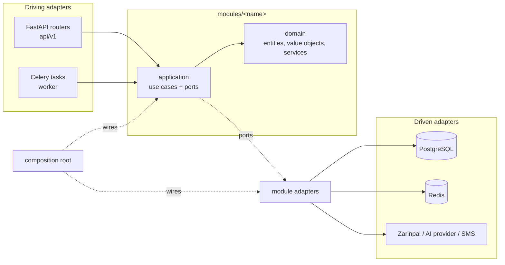
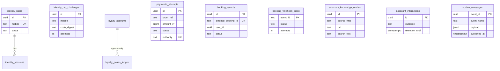
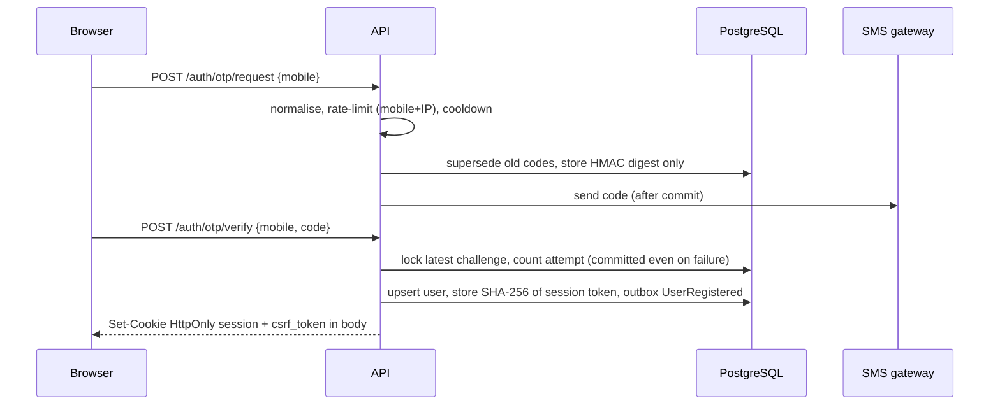
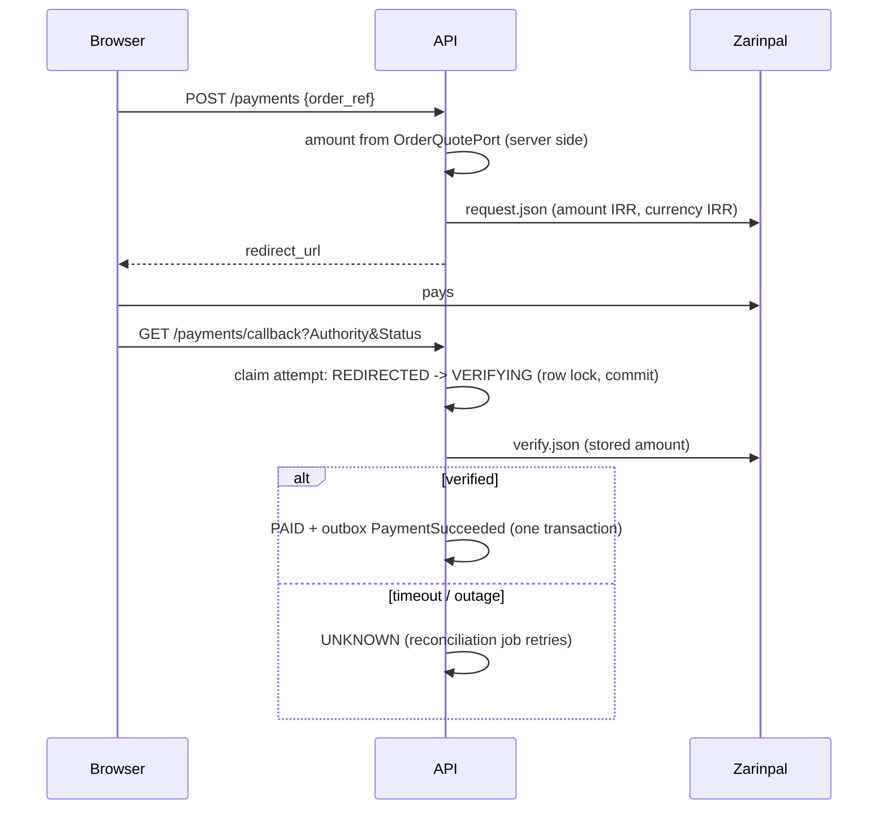
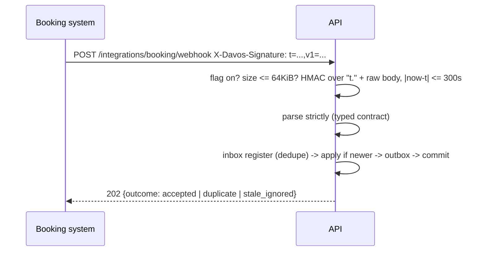

# Architecture

## 1. Shape

A single deployable (modular monolith). Modules are separated by explicit contracts so a hot module can be extracted later
without rewriting its callers.

Dependency rule: `adapters -> application -> domain`. Nothing points the other way (import-linter `layers` contract).

## 2. Modules

| Module | Responsibility | Ports it owns |
| --- | --- | --- |
| `identity` | OTP challenges, users, sessions | `OtpChallengeRepository`, `UserRepository`, `SessionRepository`, `OtpHasher`, `OtpCodeGenerator`, `OtpDelivery`, `SessionTokenService` |
| `assistant` | Grounded FAQ answers, knowledge index, interaction log | `AIChatPort`, `KnowledgeSearchPort`, `KnowledgeIndexPort`, `AiBudgetPort`, `InteractionLogPort` |
| `loyalty` | Points ledger, tiers, discount pricing | `PointsLedgerRepository` |
| `payments` | Payment attempts and their lifecycle | `PaymentGatewayPort`, `PaymentRepository`, `OrderQuotePort` |
| `booking` | Verified copy of bookings from the external system | `WebhookInboxRepository`, `BookingRecordRepository` |
| `notifications` | Outbound SMS contract | `SmsGatewayPort` |

Modules never import each other. They meet in three places only: **domain events** through the outbox, **plain identifiers**
(a `user_id` is a UUID, never a foreign key into another module's table), and the **composition root**, which can adapt one
module's port onto another's (for example `SmsOtpDelivery` maps identity's `OtpDelivery` onto notifications' `SmsGatewayPort`).

### Ports required by the specification

| Port | State |
| --- | --- |
| `SmsGatewayPort` | contract + development `RecordingSmsGateway` (in-memory, no delivery). **No real provider adapter.** |
| `PaymentGatewayPort` | contract + `ZarinpalPaymentGateway`; contract tested with recorded shapes, not against the live sandbox |
| `AIChatPort` | contract + `OpenAICompatibleChatAdapter`, `ResilientAiChat` (breaker + bulkhead), `DisabledAiChat` |
| `KnowledgeSearchPort` | contract + `PgTrgmKnowledgeSearch` (PostgreSQL `pg_trgm`) |
| `ConversationContextPort` | contract + `RedisConversationContext` (a few turns, minutes) and `InMemoryConversationContext` |
| `BookingGatewayPort` | **not implemented** (webhook receiving is; server-to-server inquiry/reconciliation polling is not) |
| `IdentityHandoffPort` | **not implemented** |
| `ObjectStoragePort` | **not implemented** |
| `NotificationPort` | **not implemented** (in-site notifications) |

## 3. Transactions, events and idempotency

* A use case owns a **Unit of Work** (`SqlAlchemyUnitOfWork`): one transaction, rollback unless `commit()` is called.
* Aggregates record **domain events**; the UoW writes them to `outbox_messages` **in the same transaction** as the state change
  (`OutboxRecorder`). There is no path that commits state without its events, or events without state.
* `OutboxRelay` claims rows with `FOR UPDATE SKIP LOCKED`, dispatches to Celery (queue chosen by event name), retries with
  exponential backoff + jitter, and **dead-letters** after `max_attempts`. Delivery is at-least-once; the Celery task id is the
  event id, and consumers must be idempotent.
* Idempotency is enforced by the database, not by hope:

| Concern | Mechanism |
| --- | --- |
| Same OTP verified twice concurrently | `SELECT ... FOR UPDATE` on the challenge; exactly one session |
| Two first logins for one mobile | `INSERT ... ON CONFLICT DO NOTHING` on the unique mobile |
| Points granted twice for one event | unique `(customer_id, kind, source_ref)` on the ledger |
| Points spent twice / overspent | per-customer account row lock, balance checked under the lock |
| Ledger edited after the fact | database trigger rejects `UPDATE`/`DELETE` (append-only) |
| Payment verified/recorded twice | `VERIFYING` claim under row lock + unique partial index `one PAID per order` |
| Webhook delivered many times | inbox primary key = provider event id, row lock on repeats |
| Webhook delivered out of order | `updated_at` compare on the booking record; stale events are recorded and ignored |

## 4. API conventions

* Versioned under `/api/v1`; OpenAPI at `/api/docs` in development, disabled in production.
* Errors are always `{code, message, details[], request_id}`. `message` is Persian and safe to show; stack traces, provider
  bodies and internal reasons never reach the client. `X-Request-ID` is accepted (validated) or generated and logged.
* Routes are thin: validate input, authenticate, call one use case, map to a response schema. ORM models never leave the
  adapters; use cases take/return plain dataclasses.
* Cookie sessions are `HttpOnly`, `SameSite=Lax`, `Secure` (configurable, forced on in production). State-changing requests
  need a per-session CSRF token header plus an allowed `Origin`.

## 5. Data model

Cross-module references (`user_id`, `customer_id`) are plain UUID columns on purpose. Timestamps are `timestamptz` (UTC); money is
integer **IRR** (`Money`), with an explicit, exact Toman conversion for display.

## 6. Sequences

**Sign-in**

**Payment** - the browser only *triggers* verification.

**Booking webhook**

## 7. Decisions

| Decision | Reason |
| --- | --- |
| Loyalty balance is derived from an append-only ledger, not a column | auditability; concurrency handled by one lock row, not by `UPDATE balance` races |
| Discount engine is a pure function over rules | deterministic precedence is testable without a database |
| Time-of-check work uses row locks, uniqueness uses constraints | correctness does not depend on application-level checks |
| Payment amounts never come from the client | the request schema has no amount field; `OrderQuotePort` is the only source |
| AI never called without relevant published sources | cheaper, and removes the main hallucination path |
| Per-process circuit breaker | each replica protects itself; no shared lock needed |
| Worker builds its container inside each task's event loop | async resources are loop-bound (a real bug found in the running stack) |
| `Redis` for rate limits, budgets and sessions' counters | state must be shared across API replicas |
